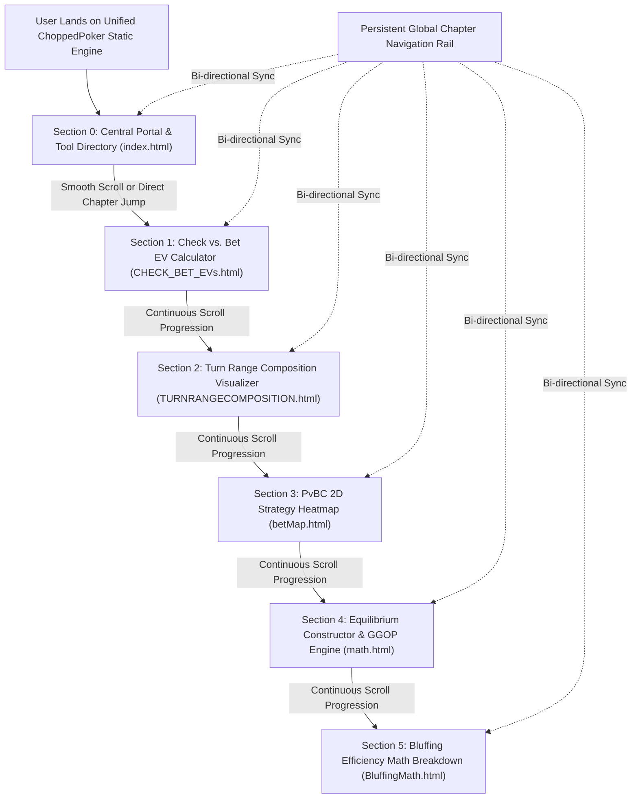

# Functional Specification 001: Unified ChoppedPoker Static Engine — Full Content Consolidation, Seamless Scrolly-Telling Transitions, and High-Fidelity Interactive Simulation

## 1. Executive Summary & Operational Objective

The ChoppedPoker repository currently contains a disparate collection of six standalone HTML tools (`index.html`, `CHECK_BET_EVs.html`, `TURNRANGECOMPOSITION.html`, `betMap.html`, `math.html`, and `BluffingMath.html`). While each tool delivers advanced Game Theory Optimal (GTO) poker modeling, their isolation across separate files fragments the user experience and requires disruptive page navigation.

The operational objective of this functional specification is to establish the complete behavioral requirements for consolidating all six distinct components into a **single, unified, standalone static HTML application**. 

This unification must satisfy three non-negotiable functional pillars:
1. **Strict Content Identity:** 100% of mathematical models, input sliders, calculation parameters, default values, visual representations, formulas, popover explanations, and interactive readouts from the six source files must be preserved without loss or alteration.
2. **Seamless Scrolly-Telling Progression:** The consolidated application must present a cohesive narrative sequence guiding the user through foundational EV decisions, range filtering, 2D equilibrium defense, multi-street geometric construction, and bluff efficiency formulas.
3. **Flawless Interaction & Scroll Hygiene:** Scrolling and interactive controls must never conflict. The interface must eliminate scroll-trapping, wheel event hijacking on range sliders, canvas gesture conflicts, and layout jumping.

**CRITICAL DIRECTIVE: DO NOT IMPLEMENT CODE YET. This document specifies pure functional requirements, behavioral invariants, input/output contracts, and acceptance criteria for handoff to an implementation assistant.**

---

## 2. Governing System Vocabulary & Evaluation Parameters (`LANGUAGE.md`)

All evaluations, invariants, error taxonomies, and sufficiency criteria throughout this specification strictly adhere to [`LANGUAGE.md`](file:///Users/diesel/Desktop/ChoppedPoker/LANGUAGE.md):

- **`{functionality}`**: The complete user-facing capability of the unified single-page application to smoothly present, navigate, and simultaneously execute all six interactive poker theory modules with seamless scrolly-telling transitions.
- **`{correctness}`**: Precise local execution of all mathematical formulas (MDF $\alpha$, EV differentials, range filter ratios, pixel-by-pixel strategy heatmap EV evaluations, geometric pot sizing, and KaTeX equation formatting) matching the exact numerical baselines of the source files.
- **`{errors}`**: Explicit failure states, including browser console exceptions, unhandled DOM element lookups, broken KaTeX rendering, canvas rendering anomalies, failed script loads, or layout overflow regressions.
- **`{correct required outputs}`**: A single, fully standalone static HTML file embedding all six tool modules, a responsive global chapter progress navigation bar, functional sliders updating live readouts identically to the source tools, and smooth section transitions.
- **`{sufficient}`**: Complete specification of all component layouts, mathematical equations, default parameters, scroll transition mechanics, and edge case governance such that a coding assistant can implement the unified application without making assumptions.
- **`{insufficient}`**: Any specification leaving slider event management, canvas scaling, section boundaries, or mathematical equivalence ambiguous or undefined.

---

## 3. Operational Workflow & System Architecture

---

## 4. Component Inventory & Content Preservation Invariants

The unified application must integrate all six source tools as distinct, beautifully sequenced chapters. No text, control, or formula may be truncated or omitted.

### 4.1. Section 0: Portal & Navigation Nexus (Source: `index.html`)
1. **Typography & Title:** Brutalist gradient headline `"POKER LOGIC ENGINE"`.
2. **Ambient Particle System:** Canvas-based floating suit particles (♠, ♥, ♦, ♣) with randomized upward drift, opacity variation, and boundary recycling.
3. **Marquee Ticker:** Infinite horizontal ticker reciting core poker theory concepts (`GTO STRATEGY /// NASH EQUILIBRIUM /// EV CALCULATIONS /// RANGE CONSTRUCTION /// INDIFFERENCE PRINCIPLE /// MINIMUM DEFENSE FREQUENCY /// GEOMETRIC SIZING /// BLUFF EFFICIENCY`).
4. **Interactive Feature Cards:** Four 3D interactive glassmorphism cards representing the core tool chapters:
   - Card 1: Check vs Bet EV Calculator (Ace of Spades).
   - Card 2: Turn Range Composition (King of Hearts).
   - Card 3: PvBC Strategy Map (Queen of Diamonds).
   - Card 4: Equilibrium Constructor (Jack of Clubs).
   - *Behavioral Update:* Clicking `"Open Tool →"` on any card must smoothly scroll the viewport directly to that tool's section on the page rather than navigating to an external URL.
5. **Mouse-Tracking Tilt:** 3D perspective tilt effect reacting to cursor position within each card.

### 4.2. Section 1: Check vs. Bet EV Decision Engine (Source: `CHECK_BET_EVs.html`)
1. **Visual Styling:** Brutalist high-contrast dark theme with 3px solid borders, vibrant orange accent (`#ff4d00`), and monospace layout.
2. **Interactive Controls & Baseline Defaults:**
   - **Pot Size ($P$):** Range slider (Min: 10, Max: 1000, Step: 10, Default: `100`).
   - **Bet Size ($B$):** Range slider (Min: 10, Max: 1000, Step: 10, Default: `75`).
   - **Opponent Total Combos ($N$):** Range slider (Min: 10, Max: 200, Step: 1, Default: `100`).
   - **Hero Equity vs. Calling Range ($E$):** Range slider (Min: 0%, Max: 100%, Step: 1%, Default: `55%`).
3. **Mathematical Computation Engine:**
   - **MDF ($\alpha$):** $\alpha = \frac{P}{P + B}$ (Displayed as percentage to 1 decimal place).
   - **Calling Range Combos:** $\text{Combos} = N \times \alpha$ (Displayed to 1 decimal place).
   - **EV Check:** $EV_{\text{check}} = E \times P$.
   - **EV Called:** $EV_{\text{call}} = (E \times (P + 2B)) - B$.
   - **EV Differential ($\Delta EV$):** $\Delta EV = EV_{\text{call}} - EV_{\text{check}}$.
4. **Verdict State Badge:**
   - If $E > 0.50$: Display `"VALUE BET"` with orange highlight background.
   - If $E = 0.50$: Display `"INDIFFERENT"` with high-contrast white background.
   - If $E < 0.50$: Display `"CHECK"` with dark muted background.
5. **Dynamic Parallax Visuals:** Interactive background grid reacting subtly to cursor movement.

### 4.3. Section 2: Turn Range Composition Visualizer (Source: `TURNRANGECOMPOSITION.html`)
1. **Visual Styling:** Technical blueprint dark theme with vivid blue (`#2979FF`) and orange (`#FF5722`) dual-tone metrics.
2. **Interactive Controls & Baseline Defaults:**
   - **Flop Value C-Bet Frequency:** Range slider (Min: 0%, Max: 100%, Step: 1%, Default: `70%`).
   - **Flop Bluff C-Bet Frequency:** Range slider (Min: 0%, Max: 100%, Step: 1%, Default: `40%`).
3. **Mathematical Filtering Engine:**
   - Pre-flop Baseline Combos: $C_{\text{value}} = 40$ combinations, $C_{\text{air}} = 60$ combinations.
   - Turn Value Combos: $T_{\text{value}} = C_{\text{value}} \times f_{\text{val\_freq}}$.
   - Turn Air Combos: $T_{\text{air}} = C_{\text{air}} \times f_{\text{bluff\_freq}}$.
   - Total Arriving Combos: $T_{\text{total}} = T_{\text{value}} + T_{\text{air}}$.
   - Value Composition %: $\frac{T_{\text{value}}}{T_{\text{total}}} \times 100$.
   - Air Composition %: $\frac{T_{\text{air}}}{T_{\text{total}}} \times 100$.
4. **Live Visual Representation:**
   - Dual-colored segmented ratio bar dynamically adjusting the proportion between Value (Blue) and Air (Orange).
   - Live numeric readouts formatted to 1 decimal place.
   - Mathematical formula indicator: $\text{Ratio } N = \frac{\text{Air}}{\text{Value} + \text{Air}}$.

### 4.4. Section 3: PvBC 2D Strategy Heatmap (Source: `betMap.html`)
1. **Visual Styling:** Swiss International Typographic Style (high-contrast black/white structure with Cobalt Blue `#0047BB` and Swiss Red `#FF3030`).
2. **Interactive Sidebar Controls & Baseline Defaults:**
   - **Stack Depth ($S$):** Range slider (Min: 10, Max: 500, Step: 5, Default: `100`).
   - **Pot Size ($P$):** Range slider (Min: 5, Max: 200, Step: 5, Default: `30`).
   - **Turn Bet Size ($B$):** Range slider (Min: 5, Max: 200, Step: 5, Default: `20`).
   - **Nut Advantage ($N$):** Range slider (Min: 0.00, Max: 1.00, Step: 0.01, Default: `0.25`).
   - **Turn C-Bet Freq ($c_T$):** Range slider & Canvas coordinate $X$ (Min: 0.00, Max: 1.00, Step: 0.01, Default: `0.60`).
   - **River C-Bet Freq ($c_R$):** Range slider & Canvas coordinate $Y$ (Min: 0.00, Max: 1.00, Step: 0.01, Default: `0.50`).
3. **Pixel-Shaded 2D Canvas Matrix:**
   - 2D coordinate plane mapping $X = c_T$ (0.0 to 1.0) and $Y = c_R$ (0.0 at bottom to 1.0 at top).
   - Pixel classification logic evaluated across all $(c_T, c_R)$ points:
     - **Impossible Region:** If $c_T < N$, color pixel pure white (`#FFFFFF`).
     - **EV(Fold):** $EV_{\text{fold}} = S$.
     - **EV(Call-Fold):** $EV_{\text{cf}} = (1 - c_R) \times (S + P + B) + c_R \times (S - B)$.
     - **EV(Call-Call):** $EV_{\text{cc}} = \left(\frac{c_T - c_R c_T}{c_T}\right) \times (S + P + B) + \left(\frac{c_R c_T - N}{c_T}\right) \times (2S + P)$.
     - **Strategy Assignment:**
       - If $\max(EV) = EV_{\text{fold}}$: Pixel color Dark Grey (`#333333`).
       - If $\max(EV) = EV_{\text{cf}}$: Pixel color Swiss Red (`#FF3030`).
       - If $\max(EV) = EV_{\text{cc}}$: Pixel color Cobalt Blue (`#0047BB`).
4. **Interactive Crosshair & Live Telemetry:**
   - Draggable crosshair on the canvas updating $c_T$ and $c_R$ in real time.
   - Numerical readout panel displaying current coordinates, computed EV values for all three strategic choices, and the active optimal action badge.

### 4.5. Section 4: Equilibrium Constructor & GGOP Engine (Source: `math.html`)
1. **Visual Styling:** Editorial print aesthetic with paper texture background, bold black typography, and vivid brutalist red accents (`#FF3B00`).
2. **Interactive Controls & Baseline Defaults:**
   - **Starting Pot ($P_{\text{start}}$):** Numeric input (Default: `10`).
   - **Effective Stack ($S_{\text{eff}}$):** Numeric input (Default: `75`).
   - **River Value Hands ($V$):** Numeric input (Default: `40`).
3. **KaTeX-Rendered Calculations:**
   - **Geometric Growth of Pot (GGOP):**
     - Growth Multiplier: $R = \frac{P_{\text{start}} + 2S_{\text{eff}}}{P_{\text{start}}}$.
     - Multi-Street Sizing Factor: $r = \sqrt{R} - 1$.
     - Bet Percentage: $r \times 100\%$.
   - **Street Pot Progression:**
     - Turn Pot: $P_{\text{turn}} = P_{\text{start}} + 2 \times (r \times P_{\text{start}})$.
     - River Pot: $P_{\text{river}} = P_{\text{turn}} + 2 \times (r \times P_{\text{turn}})$.
     - Final All-In Pot: $P_{\text{final}} = P_{\text{start}} + 2S_{\text{eff}}$.
   - **River Indifference & Bluff Allocation:**
     - River Alpha: $\alpha_{\text{river}} = \frac{\text{Bet}_{\text{river}}}{\text{Pot}_{\text{river}} + 2 \times \text{Bet}_{\text{river}}}$.
     - River Bluff Combos: $B_R = V \times \alpha_{\text{river}}$.
   - **Turn Indifference & Recursive Range Expansion:**
     - Turn Value Base: $V_{\text{turn}} = V + B_R$.
     - Turn Alpha: $\alpha_{\text{turn}} = \frac{\text{Bet}_{\text{turn}}}{\text{Pot}_{\text{turn}} + 2 \times \text{Bet}_{\text{turn}}}$.
     - Turn Bluff Combos: $B_T = V_{\text{turn}} \times \alpha_{\text{turn}}$.
     - Total Starting Action Range: $V + B_R + B_T$.
4. **Anchored Popover Playing Cards:**
   - Interactive pill chips (`info-chip`) for:
     - `"Geometric Growth"`
     - `"Indifference (Alpha)"`
     - `"Reverse Engineering"`
   - Clicking an info-chip displays an anchored 3D playing card popover with smooth KaTeX math formulas.
   - Clicking the card flips it in 3D space to reveal random playing card art (Ace through 8, Spades/Hearts/Diamonds/Clubs).
   - Clicking outside dismisses the popover.

### 4.6. Section 5: Bluffing Efficiency Math Breakdown (Source: `BluffingMath.html`)
1. **Visual Styling:** Deep indigo/purple gradient background with animated liquid glassmorphism ambient blobs.
2. **Interactive Equation 11.7 Presentation:**
   $$\frac{B}{B + P} < \frac{F_T - F_T E_f}{1 - E_s}$$
3. **Interactive Hover Zones & Explanatory Drawer:**
   - **Cost Zone ($\frac{B}{B + P}$):** Explains raw betting cost relative to reward.
   - **Numerator Zone ($F_T - F_T E_f$):** Explains folded threats and isolating superior hands forced to fold.
   - **Denominator Zone ($1 - E_s$):** Explains target audience and total opponent range beating hero.
   - Dynamically highlights corresponding fraction elements and updates the frosted glass explanation panel with rich typography.

---

## 5. Seamless Scrolly-Telling & Interaction Transition Invariants

The unified application must deliver an effortless, cinematic progression across all sections without sacrificing the tactile usability of any individual tool.

### 5.1. Persistent Global Chapter Rail
1. **Fixed Sidebar/Header Rail:** A minimal, unobtrusive progress indicator fixed to the viewport boundary:
   - Displays all chapter titles: `Overview`, `EV Engine`, `Turn Range`, `PvBC Heatmap`, `Equilibrium`, `Bluff Efficiency`.
   - Actively highlights the current chapter based on continuous viewport scroll intersection.
   - Clicking any chapter title initiates a smooth scroll directly to that section.
2. **Z-Index Layering Integrity:** The global navigation rail must stay above ambient background canvases, but must never occlude interactive sliders, popover playing cards, or crosshair canvases.

### 5.2. Elimination of Scroll-Trapping & Gesture Conflicts
1. **Slider Wheel Isolation:**
   - Standard vertical page scrolling must pass unhindered across all range slider controls.
   - Range sliders must **only** adjust values via explicit click-and-drag or touch events. Unfocused mouse wheel events must never accidentally scrub slider values while scrolling past.
2. **Canvas Touch & Drag Hygiene:**
   - On the Section 3 strategy heatmap, single-finger touch or mouse-wheel gestures must scroll the page vertically.
   - Crosshair repositioning on the canvas must be triggered by direct touch drag on the crosshair or explicit pointer interaction, preventing the canvas from capturing and deadlocking the user's scroll flow.
3. **Sticky Sidebar Release:**
   - In sections utilizing sticky control panels (Section 3 and Section 4), the sticky containment must be strictly bounded to that section's height. As the user reaches the bottom boundary of the section, the sticky panel must gracefully unstick and slide naturally out of view.

### 5.3. Harmonious Visual Transitions
1. **Thematic Cohesion:** Rather than harsh abrupt breaks between dark brutalism, white Swiss layout, editorial paper, and liquid neon blobs, section boundaries must employ subtle gradient transitions, frosted glass separator masks, or progressive backdrop blend modes.
2. **Particle Canvas Transition:** The floating suit particle canvas from Section 0 must gently fade out as the user scrolls into Section 1 to preserve focus and minimize GPU rendering overhead during calculation-heavy interactions.

---

## 6. Input / Output Contracts & DOM Architecture

### 6.1. File Delivery Contract
- **Artifact:** Single, self-contained `index.html` (or designated target HTML file) incorporating all HTML structure, CSS styling, inline or external CDN font/KaTeX references, and JavaScript simulation logic.
- **Dependencies:** Self-contained or pinned to reliable public CDNs (Google Fonts, KaTeX 0.16.9) matching the source files.

### 6.2. Semantic Anchor Structure
Every chapter must possess a deterministic, unique HTML ID:
- `#portal-nexus`: Section 0 (Portal & Feature Cards)
- `#ev-engine`: Section 1 (Check vs Bet EV Calculator)
- `#range-filter`: Section 2 (Turn Range Composition)
- `#strategy-heatmap`: Section 3 (PvBC 2D Strategy Map)
- `#equilibrium-constructor`: Section 4 (Equilibrium Constructor & GGOP)
- `#bluff-efficiency`: Section 5 (Equation 11.7 Math Breakdown)

---

## 7. Edge Case Governance & Fail-Fast Criteria

1. **Zero Combos in Range Composition:** If both Value and Bluff sliders in Section 2 are set to 0%, the visualizer must safely display `50% / 50%` neutral bar widths and `"-"` for percentage readouts, avoiding `NaN%` or division-by-zero crashes.
2. **Impossible Strategy Region:** In Section 3, when $c_T < N$, the pixel shader must strictly color the coordinate pure white and render the readout strategy as `"IMPOSSIBLE"`, with $EV = 0$, preventing negative or invalid EV calculations.
3. **Canvas HiDPI Scaling:** Canvases (particles, heatmap) must respect `window.devicePixelRatio` to prevent blurred rendering on Retina and high-density screens.
4. **Popover Boundary Collision:** The Section 4 anchored playing card modal must compute its offset against `window.innerWidth` and flip or shift inward if anchored near the right edge of the screen, preventing horizontal window blowout.
5. **DOM Selector Clashes:** Because variables and element IDs (such as `canvas`, `ctx`, `update`, `calculate`, `suits`, `cards`) were shared across the individual source files, the unified architecture must isolate tool logic namespaces (or modular function scopes) so that event listeners and calculation loops do not contaminate or overwrite each other.

---

## 8. Objective Acceptance Criteria & Verification Matrix

| Verification ID | Category | Behavioral Invariant | Pass Criteria |
| :--- | :--- | :--- | :--- |
| **AC-01** | Content Preservation | All 6 tools present in single file | DOM contains Section 0 through Section 5 with all baseline inputs, sliders, and formulas intact. |
| **AC-02** | Mathematical Equivalence | Section 1 EV Calculations | At $P=100, B=75, N=100, E=55\%$: $\text{MDF} = 57.1\%$, Range $= 57.1\text{ hands}$, $EV_{\text{check}} = 55.00$, $EV_{\text{call}} = 62.50$, $\Delta EV = +7.50$, Verdict $=$ `"VALUE BET"`. |
| **AC-03** | Mathematical Equivalence | Section 2 Range Filtering | At Value $= 70\%$, Bluff $= 40\%$: Value Comp $= 53.8\%$, Air Comp $= 46.2\%$. At $0\%/0\%$, displays `"-"` without error. |
| **AC-04** | Mathematical Equivalence | Section 3 PvBC Heatmap | At default parameters ($S=100, P=30, B=20, N=0.25$): Canvas renders white impossible zone for $X < 0.25$, correct red/blue/grey zones, and crosshair updates EV readouts. |
| **AC-05** | Mathematical Equivalence | Section 4 GGOP Math | At $P_{\text{start}}=10, S_{\text{eff}}=75, V=40$: Growth $R = 16.0$, Sizing $r = 300\%$, correct river and turn alpha calculations and KaTeX formulas. |
| **AC-06** | Interactive Modal | Section 4 Card Popover | Clicking info-chips opens anchored popover; clicking card triggers 3D flip; clicking outside dismisses cleanly. |
| **AC-07** | Interaction Hygiene | Section 5 Hover Breakdown | Hovering over Cost, Numerator, and Denominator updates explanation text dynamically without flickering. |
| **AC-08** | Scroll Seamlessness | Zero Scroll-Trapping | Scrolling over sliders or canvases does not freeze page scrolling or unintentionally change slider values. |
| **AC-09** | Navigation Sync | Persistent Chapter Rail | Active chapter updates accurately during scrolling; clicking chapter smoothly navigates to target section. |
| **AC-10** | Error Governance | Browser Console Cleanliness | Zero uncaught exceptions, zero `NaN` values, and clean execution under continuous user interaction. |
